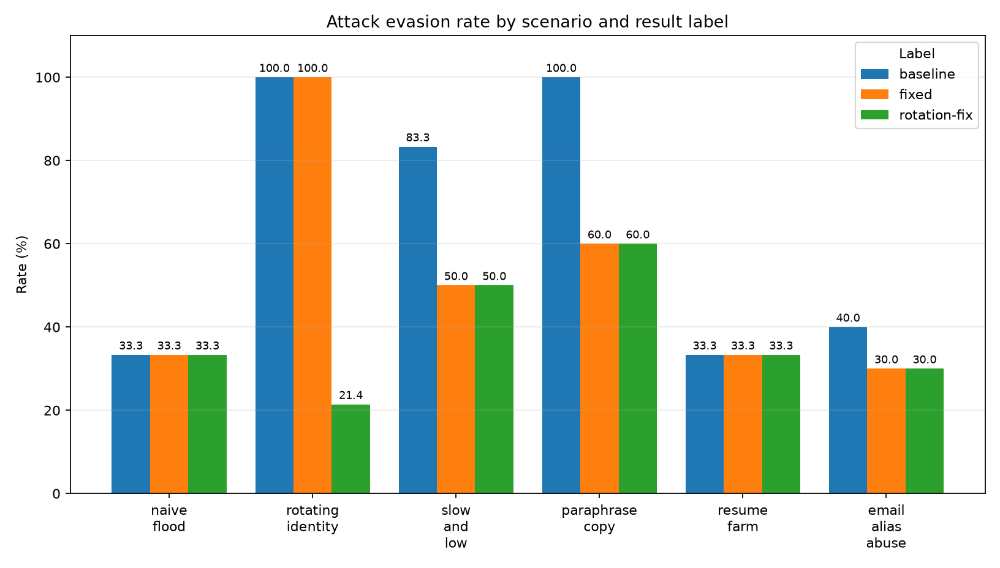
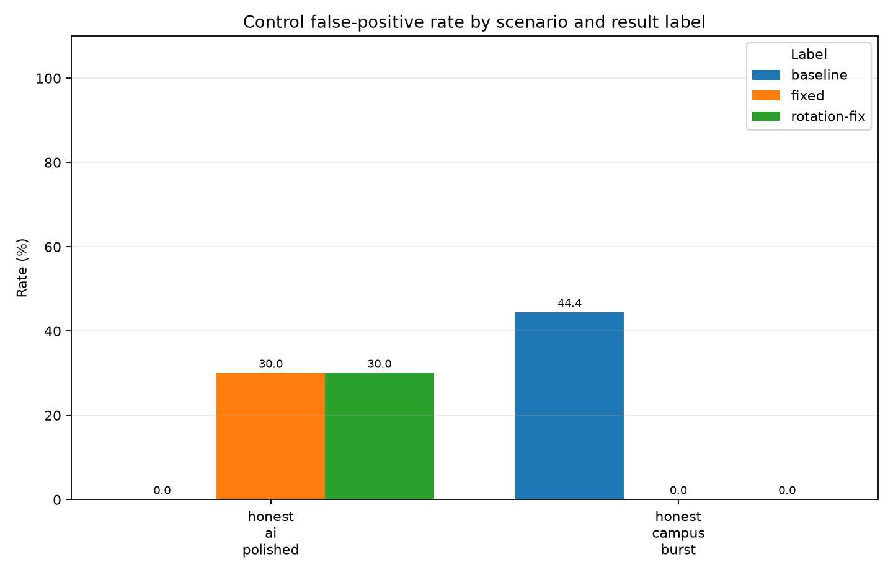

# Firewall Robustness Report

A flag means the route was `ADDITIONAL_VERIFICATION` or `MANUAL_REVIEW`; reason codes on a `PASS_TO_ATS` decision are observations, not detections for these metrics.

## Attack evasion

| Label | Attack | Applications | Evasion | Detection | First flag | Reason codes seen |
|---|---|---:|---:|---:|---|---|
| baseline | `naive_flood` | 18 | 33.3% | 66.7% | 6.0s (application 7) | FAST_SUBMIT (18), PASTE_BULK (18), VELOCITY_HIGH (12) |
| baseline | `rotating_identity` | 14 | 100.0% | 0.0% | Never | None |
| baseline | `slow_and_low` | 12 | 83.3% | 16.7% | 1680.0s (application 8) | DUP_RESUME_NEAR (2) |
| baseline | `paraphrase_copy` | 10 | 100.0% | 0.0% | Never | None |
| baseline | `resume_farm` | 12 | 33.3% | 66.7% | 32.0s (application 5) | DUP_RESUME_NEAR (8) |
| baseline | `email_alias_abuse` | 10 | 40.0% | 60.0% | 360.0s (application 5) | DUP_EMAIL (9), DUP_SAME_JOB (6) |
| fixed | `naive_flood` | 18 | 33.3% | 66.7% | 6.0s (application 7) | FAST_SUBMIT (18), PASTE_BULK (18), VELOCITY_HIGH (12) |
| fixed | `rotating_identity` | 14 | 100.0% | 0.0% | Never | None |
| fixed | `slow_and_low` | 12 | 50.0% | 50.0% | 1440.0s (application 7) | DUP_RESUME_NEAR (6) |
| fixed | `paraphrase_copy` | 10 | 60.0% | 40.0% | 450.0s (application 7) | DUP_RESUME_NEAR (4) |
| fixed | `resume_farm` | 12 | 33.3% | 66.7% | 32.0s (application 5) | DUP_RESUME_NEAR (8) |
| fixed | `email_alias_abuse` | 10 | 30.0% | 70.0% | 270.0s (application 4) | DUP_EMAIL (9), DUP_RESUME_NEAR (6), DUP_SAME_JOB (6) |
| rotation-fix | `naive_flood` | 18 | 33.3% | 66.7% | 6.0s (application 7) | FAST_SUBMIT (18), PASTE_BULK (18), VELOCITY_HIGH (12) |
| rotation-fix | `rotating_identity` | 14 | 21.4% | 78.6% | 36.0s (application 4) | IDENTITY_DEVICE_ROTATION (11) |
| rotation-fix | `slow_and_low` | 12 | 50.0% | 50.0% | 1440.0s (application 7) | DUP_RESUME_NEAR (6) |
| rotation-fix | `paraphrase_copy` | 10 | 60.0% | 40.0% | 450.0s (application 7) | DUP_RESUME_NEAR (4) |
| rotation-fix | `resume_farm` | 12 | 33.3% | 66.7% | 32.0s (application 5) | DUP_RESUME_NEAR (8) |
| rotation-fix | `email_alias_abuse` | 10 | 30.0% | 70.0% | 270.0s (application 4) | DUP_EMAIL (9), DUP_RESUME_NEAR (6), DUP_SAME_JOB (6), IDENTITY_DEVICE_ROTATION (7) |

## Control false positives

| Label | Control | Applications | Passed | False-positive rate | Reason codes seen |
|---|---|---:|---:|---:|---|
| baseline | `honest_ai_polished` | 10 | 10 | 0.0% | None |
| baseline | `honest_campus_burst` | 18 | 10 | 44.4% | VELOCITY_HIGH (8) |
| fixed | `honest_ai_polished` | 10 | 7 | 30.0% | DUP_RESUME_NEAR (3) |
| fixed | `honest_campus_burst` | 18 | 18 | 0.0% | NETWORK_BURST (8) |
| rotation-fix | `honest_ai_polished` | 10 | 7 | 30.0% | DUP_RESUME_NEAR (3) |
| rotation-fix | `honest_campus_burst` | 18 | 18 | 0.0% | NETWORK_BURST (8) |

## Gaps surfaced

- **baseline / naive_flood:** 33.3% of attack submissions reached the ATS.
- **baseline / rotating_identity:** 100.0% of attack submissions reached the ATS.
- **baseline / slow_and_low:** 83.3% of attack submissions reached the ATS.
- **baseline / paraphrase_copy:** 100.0% of attack submissions reached the ATS.
- **baseline / resume_farm:** 33.3% of attack submissions reached the ATS.
- **baseline / email_alias_abuse:** 40.0% of attack submissions reached the ATS.
- **baseline / honest_campus_burst:** 44.4% of legitimate controls were flagged.
- **fixed / naive_flood:** 33.3% of attack submissions reached the ATS.
- **fixed / rotating_identity:** 100.0% of attack submissions reached the ATS.
- **fixed / slow_and_low:** 50.0% of attack submissions reached the ATS.
- **fixed / paraphrase_copy:** 60.0% of attack submissions reached the ATS.
- **fixed / resume_farm:** 33.3% of attack submissions reached the ATS.
- **fixed / email_alias_abuse:** 30.0% of attack submissions reached the ATS.
- **fixed / honest_ai_polished:** 30.0% of legitimate controls were flagged.
- **rotation-fix / naive_flood:** 33.3% of attack submissions reached the ATS.
- **rotation-fix / rotating_identity:** 21.4% of attack submissions reached the ATS.
- **rotation-fix / slow_and_low:** 50.0% of attack submissions reached the ATS.
- **rotation-fix / paraphrase_copy:** 60.0% of attack submissions reached the ATS.
- **rotation-fix / resume_farm:** 33.3% of attack submissions reached the ATS.
- **rotation-fix / email_alias_abuse:** 30.0% of attack submissions reached the ATS.
- **rotation-fix / honest_ai_polished:** 30.0% of legitimate controls were flagged.

## Charts

